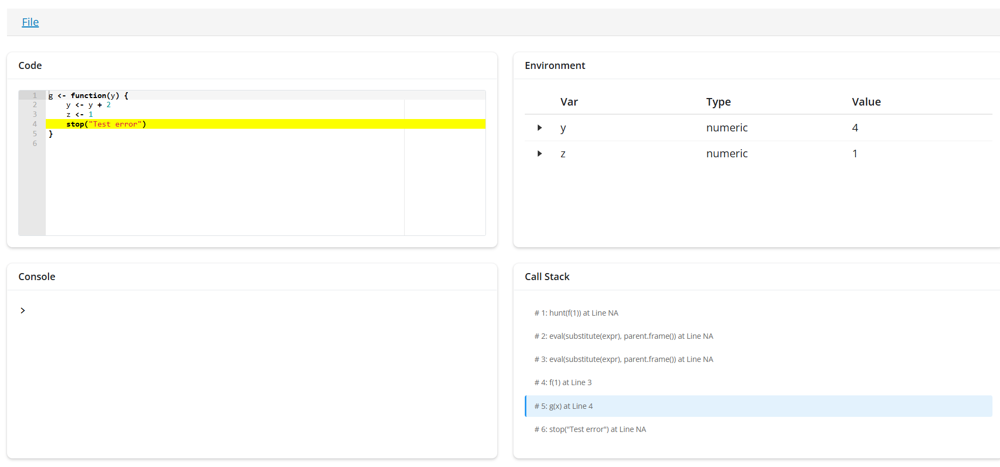

# bughunter 

<!-- badges: start -->
[](https://github.com/Jiefei-Wang/bughunter/actions)
[](https://CRAN.R-project.org/package=bughunter)
[](https://lifecycle.r-lib.org/articles/stages.html#experimental)
[](https://www.gnu.org/licenses/gpl-3.0)
<!-- badges: end -->

## Overview

**Tired of cryptic error messages?** 😫  
**Struggling to explain bugs to others?** 🐛  
**Wish you could see *exactly* what went wrong?** 🔍

**bughunter** transforms R debugging from frustrating guesswork into surgical precision. When errors strike, `hunt()` captures *everything*—the complete call stack, source code, line numbers, variable states, and more—then serves it up in a beautiful, interactive Shiny interface.

**Share bugs with clarity. Debug with confidence. Hunt like a pro.** 🎯

## Features

- 🎯 **Complete Error Capture**: Automatically captures call stacks, source code, line numbers, and error messages
- 🔍 **Interactive Debugging Interface**: Browse through stack frames with an integrated Shiny app
- 📝 **Source Code Visualization**: View the exact source code and line where each function failed
- 🌲 **Environment Inspection**: Examine variables and their values at each level of the call stack
- 💾 **Persistent Storage**: Save and reload debugging sessions for later analysis
- ⚡ **Easy Integration**: Wrap your code with `hunt()` or set as global error handler

## How to install
You can install it using the following command:
```{r}
devtools::install("Jiefei-Wang/bughunter")
```


## Example
```{r}
inspect(example_capture)
```


## Demo
Suppose you have a simple R script that throws an error:
```{r}
f <- function(x) {
    x <- x + 1
    g(x)
}
g <- function(y) {
    y <- y + 2
    z <- 1
    stop("Test error")
}
f(1)
# Error in g(x) : Test error
```

We use the `hunt()` function to hunt for bugs and `getLastCapture()` to retrieve your capture from the last hunting:
```{r}
library(bughunter)
hunt(f(1))
capture <- getLastCapture()
print(capture)
# Capture Object with 6 calls
# Frame 1: hunt(f(1)) stopped at line NA
# Frame 2: eval(substitute(expr), parent.frame()) stopped at line NA
# Frame 3: eval(substitute(expr), parent.frame()) stopped at line NA
# Frame 4: f(1) stopped at line 3
# Frame 5: g(x) stopped at line 4
# Frame 6: stop("Test error") stopped at line NA
```

## Let's Inspect our hunting result!
Debugging your code is never that easy, just inspect your capture object! BOOM! You have a fully interactive Shiny app to explore your error:
```{r}
inspect(capture)
```



## Limitations

- Source code capture requires code to be sourced with `keep.source = TRUE`
- Very deep call stacks may impact performance
- Not suitable for capturing errors in C/C++ code

## Contributing

Contributions are welcome! Please feel free to submit a Pull Request.

## License

GPL-3

## Author

Jiefei Wang

---

**Note**: This package is experimental. Please report any issues on the [GitHub repository](https://github.com/Jiefei-Wang/bughunter/issues).
